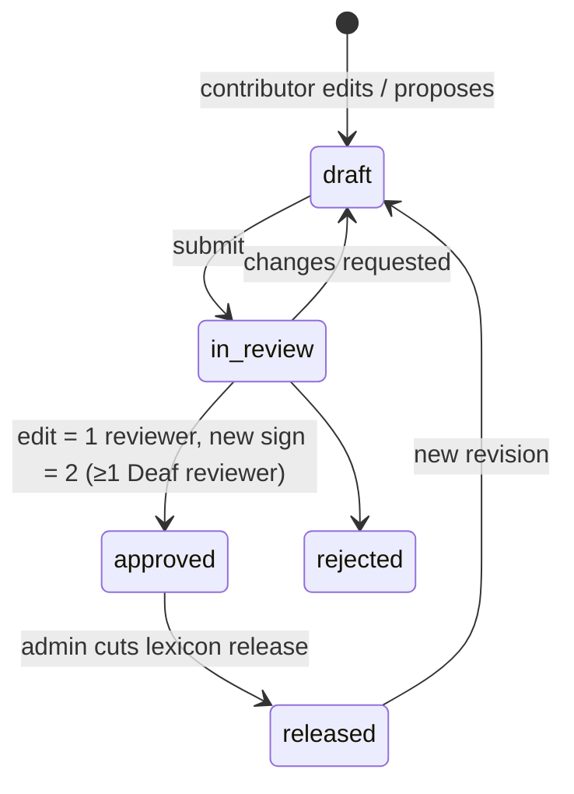

# SignLnk — Master Plan
Version 1.1 · 2026-10-05 (v1 2026-10-01; v1.1 adds the Claude Code workflow: §3, §7, §11, §13, §14, §15) · Scope: **ASL (ase) ↔ English (en)** only

This is the long-form plan. `PROJECT_CONTEXT.md` is the short summary; when they disagree, update both.
Items marked **[VERIFY]** are facts that must be checked against the source before relying on them.

---

## 0. Decisions in force

| Topic | Decision |
|---|---|
| Sign language | ASL only (`ase`). Pipeline stays language-agnostic: the language is a config value. |
| Written/spoken language | English (`en`) |
| Signer advisors | Recruit ≥2 fluent Deaf ASL signers before the public demo; paid where possible |
| Compute | Kaggle / Colab free tiers for training; inference on CPU/browser. Name one low-end benchmark laptop. |
| Code license | Apache-2.0. Models and data carry their own license files. |
| Commercial use | Not now, door kept open → two data tracks (release = permissive only; research = non-commercial allowed) |
| Phase 1 vocabulary | 20–50 meeting-relevant signs, chosen by signer advisors |
| Install model | One-sided: works when only the Deaf user has the app |
| First platform | Chrome/Edge on Windows → macOS → Linux |
| Capture consent | On-device only, visible indicator, one-click chat notice, no recording by default |
| Delivery | Website demo → installable PWA → optional Tauri desktop companion (Phase 6) |
| Meeting integration | Overlay, virtual camera, local audio capture, Zoom/Teams caption APIs. No bots, no DOM scraping, no Meet Media API. |
| Vocabulary curation | Signer Studio at `/studio`, review-gated |

---

## 1. Product surfaces

| Surface | Who | Phase | Notes |
|---|---|---|---|
| Public demo `/` | Anyone | 1 | No account. Camera → landmarks in the browser → captions. |
| Installed PWA | Anyone | 1 | Same code; works offline with the cached model and lexicon. |
| Signer Studio `/studio` | Invited signers | 1 (v1) → 5 (v3) | Lexicon editing, recording, review, releases |
| Desktop companion | Anyone | 6 | Tauri: virtual camera, system audio, caption sinks |
| Meeting sinks | Via desktop or PWA | 6 | Zoom caption token, Teams CART link, overlay |

---

## 2. Architecture

### 2.1 System overview

```mermaid
flowchart TB
  subgraph Client["Browser / PWA / Tauri (on-device)"]
    CAM[Camera] --> MP[MediaPipe Tasks<br/>hand+pose+face, WASM]
    MP --> NORM[Normalize<br/>packages/landmarks]
    NORM --> REC[Recognizer<br/>onnxruntime-web]
    LEXC[(Lexicon bundle cache<br/>IndexedDB)] --> REC
    REC --> DEC[Decoder<br/>threshold / debounce]
    DEC --> GLOSS[Gloss events]
    GLOSS --> T2E[Gloss→English<br/>Phase 4]
    T2E --> SINKS{{CaptionSink[]}}
    MIC[Mic / system audio] --> VAD[VAD] --> STT[Whisper<br/>Phase 3]
    STT --> E2G[English→gloss<br/>Phase 4]
    E2G --> RENDER{{SignRenderer}}
    RENDER --> OUT[Clips → pose → avatar]
  end
  subgraph Server["Self-hosted (Docker Compose)"]
    API[FastAPI] --> DB[(PostgreSQL)]
    API --> FS[(Object store / disk<br/>clips, bundles, models)]
  end
  LEXC <-->|versioned bundle download| API
  STUDIO[/studio UI/] <-->|REST + auth| API
  SINKS --> OVL[Overlay window]
  SINKS --> VCAM[Virtual camera]
  SINKS --> CAP[Zoom / Teams caption APIs]
```

Rules:
- Raw video never leaves the device. Audio is processed locally (whisper.cpp / faster-whisper).
- The server only handles the lexicon, Studio, model/bundle distribution, and (Phase 6) signalling. The demo works with **no server**: static hosting plus bundled model and lexicon.
- LLMs are optional post-processors behind a feature flag, never required.

### 2.2 Direction A latency budget (sign end → caption visible)

| Stage | Budget | Measured by |
|---|---|---|
| Frame capture + landmarking | ≤ 60 ms/frame | `performance.now()` around detector |
| Normalization | ≤ 2 ms | same |
| Model inference (window) | ≤ 40 ms | same |
| Decoder (end-of-sign detection) | ≤ 300 ms | timestamp of last active frame → emit |
| Render caption | ≤ 50 ms | emit → paint |
| **Total p95** | **< 500 ms** | `latency` telemetry stored locally, exported on demand |

The fps target is ≥ 25 fps on the benchmark laptop. If the laptop can't reach it, the fallback is to run hands every frame and face/pose every other frame.

### 2.3 Direction B pipeline

```
mic/system audio → Silero VAD → Whisper (local) → English text
  → English→gloss (Phase 3: dictionary lookup; Phase 4: rule-based baseline → seq2seq model)
  → SignOutputRequest → SignRenderer (ClipRenderer → PoseRenderer → AvatarRenderer)
```

Unknown words fall back to fingerspelling clips. This is a poor experience if used often, so the fallback rate is tracked as a metric.

---

## 3. Repository layout (monorepo)

```
signlnk/
├── CLAUDE.md                     # rules for Claude Code (imports PROJECT_CONTEXT.md)
├── PROJECT_CONTEXT.md            # short context: current phase, decisions, interfaces
├── .claude/                      # committed Claude Code config (docs/WORKFLOW.md §8)
│   ├── settings.json             # permission rules + hook registration
│   ├── hooks/                    # guard-paths, post-edit, session-context, prompt-router, stop-gate (Node)
│   ├── rules/                    # path-scoped rules: landmarks, schemas, ml, web-privacy, lexicon-data, claude-config
│   ├── agents/                   # plan-reviewer, privacy-reviewer, license-auditor, test-runner
│   └── skills/                   # /verify /step /session-close /schema-change /adr /dataset-license /phase-gate
├── docs/
│   ├── PLAN.md                   # this file
│   ├── WORKFLOW.md               # how we work with Claude: sessions, steps, verification
│   ├── TOOLKIT.md                # agents, skills, MCPs by phase status
│   ├── CHANGELOG.md              # history (moved out of PROJECT_CONTEXT.md)
│   ├── datasets.md               # licence, version, track of every dataset
│   ├── specs/                    # feature specs from the interview pattern (Phase 1+)
│   ├── adr/                      # architecture decision records (0001-…)
│   ├── consent/                  # recording consent form, contributor agreement
│   └── review/                   # community review checklists and sign-offs
├── packages/
│   ├── schemas/                  # JSON Schema = single source of truth
│   │   ├── landmark_layout.v1.json
│   │   ├── recognition_output.v1.json
│   │   ├── ws_message.v1.json
│   │   ├── lexicon_entry.v1.json
│   │   └── sign_output_request.v1.json
│   └── landmarks/                # TS: MediaPipe wrapper + normalization (mirrors ml/features)
├── apps/
│   ├── web/                      # Next.js PWA: demo + /studio
│   └── desktop/                  # Tauri (Phase 6)
├── services/
│   └── api/                      # FastAPI: lexicon, studio, auth, bundles
├── ml/
│   ├── signlnk_ml/
│   │   ├── data/                 # loaders: kaggle_islr, studio_export, splits
│   │   ├── features/             # normalization (mirrors packages/landmarks)
│   │   ├── models/               # encoder, heads
│   │   ├── train.py  eval.py  export_onnx.py  prototypes.py
│   └── configs/                  # YAML per experiment
├── lexicon/
│   ├── core/                     # CC BY 4.0 entries authored in Studio (exported snapshots)
│   └── reference/                # OPTIONAL NC packs (ASL-LEX), never in release bundles
├── tests/fixtures/               # golden landmark files for parity tests
├── docker-compose.yml
└── .github/workflows/            # CI
```

Tooling (free): pnpm workspaces (JS), uv (Python), Ruff + mypy, ESLint + Prettier, pytest, Vitest, Playwright, GitHub Actions. Types are generated from `packages/schemas`: `json-schema-to-typescript` for TS, `datamodel-code-generator` for Pydantic. Pin exact versions in lockfiles at scaffold time.

---

## 4. Stable interfaces

Only add fields; never rename or remove them. Breaking changes require a new version (`.v2`) and an ADR.

### 4.1 Landmark frame
- Tensor `float32[T, N, 3]` (x, y, z). Missing landmark = `NaN`. `T` = frames, `N` fixed by layout.
- Layout `slk-landmarks-v1` (exact indices frozen in Phase 0 and written to `landmark_layout.v1.json`):
  - both hands: 2 × 21
  - pose upper body: shoulders, elbows, wrists, nose, eyes, ears (subset of the 33 pose points)
  - face subset: lips, eyebrows, eye contours, nose tip. Enough for non-manual markers (mouthing, brow raise) without the full mesh.
- Normalization: center on the neck (midpoint of the shoulders), divide by shoulder width, keep z. Mirroring for left-dominant signers is a training **augmentation**, not applied at inference.
- **Face index parity [VERIFY]:** Kaggle ISLR was extracted with legacy MediaPipe Holistic. MediaPipe Tasks Face Landmarker appears to output more points (iris added). The layout file maps both sources to the same subset. A parity test on recorded fixtures must pass before training.

### 4.2 Recognition output (v1, extends the original)
```json
{"gloss": "THANK-YOU", "gloss_id": "ase:THANK-YOU", "confidence": 0.91,
 "t_start": 12034, "t_end": 12710,
 "top_k": [{"gloss_id": "ase:THANK-YOU", "p": 0.91}, {"gloss_id": "ase:GOOD", "p": 0.05}],
 "model_version": "isr-0.3.1", "lexicon_version": "2026.10.1"}
```

### 4.3 WebSocket message (unchanged envelope)
```json
{"type": "caption" | "gloss" | "sign_seq", "session": "uuid", "payload": {}}
```

### 4.4 Lexicon entry
```json
{
  "gloss_id": "ase:THANK-YOU", "lang": "ase", "id_gloss": "THANK-YOU", "variant": 1,
  "translations": [{"lang": "en", "text": "thank you", "sense": "gratitude"}],
  "phonology": {"handshape_dom": "B", "handshape_nondom": null, "sign_type": "one-handed",
                "location": "chin", "movement": "away", "contact": true,
                "non_manual": ["smile"]},
  "lexical_class": "interjection", "register_tags": ["everyday", "meetings"],
  "regional_tags": [], "status": "released",
  "recognition": {"enabled": true, "n_examples": 42, "n_signers": 6},
  "clips": [{"clip_id": "c_81", "license": "CC-BY-4.0", "signer_id": "s_12"}],
  "external_refs": [{"source": "asl-lex", "id": "<id>", "url": "<url>"},
                    {"source": "asl-signbank", "id": "<id>", "url": "<url>"}],
  "license": "CC-BY-4.0", "revision": 7
}
```
The phonology field names follow ASL-LEX / Signbank coding concepts, so a field mapping keeps entries cross-referenceable. We implement the fields ourselves and copy no descriptive data from those sources.

### 4.5 Sign output request (unchanged)
```json
{"lang": "ase", "glosses": ["HELLO", "YOU", "FINE"], "source_text": "Hello, how are you?"}
```

### 4.6 CaptionSink (TS)
```ts
export interface CaptionSink {
  id: string;                       // "overlay" | "virtual-camera" | "zoom-cc" | "teams-cart" | ...
  start(): Promise<void>;
  push(c: { text: string; isFinal: boolean; t: number; source: "sign" | "speech" }): Promise<void>;
  stop(): Promise<void>;
}
```

### 4.7 SignRenderer (TS)
```ts
export interface SignRenderer {
  kind: "clip" | "pose" | "avatar";
  load(req: SignOutputRequest): Promise<void>;
  play(target: HTMLElement): Promise<void>;
  stop(): void;
}
```

---

## 5. Data and licensing

### 5.1 Training data

| Dataset | License (as found) | Track | Role |
|---|---|---|---|
| PopSign ASL / Kaggle ISLR | CC BY 4.0 per authors; Kaggle competition rules also apply **[VERIFY]** | Release | Phase 1 training and evaluation |
| Own Studio recordings | Contributor consent, CC BY 4.0 | Release | Gap-filling vocabulary, test signers |
| ASL Citizen | Microsoft research license, non-commercial | Research | Benchmarking, experiments |
| Sem-Lex | **[VERIFY]**; assume non-commercial | Research | Phonology-auxiliary experiments |
| WLASL, How2Sign | Non-commercial | Research | Phase 2+ experiments |

Rules:
- `ml/configs/*.yaml` declares `track: release|research`. The export script refuses to package a release model if any research-track data was used. Enforce this in CI.
- Record the license, version, and download date of every dataset in `docs/datasets.md`.

### 5.2 Lexicon sources

| Source | License | How used |
|---|---|---|
| SignLnk core (Studio-authored) | CC BY 4.0 | Ships in release bundles |
| ASL Signbank | CC BY-NC-SA 4.0 | Gloss-naming conventions and external ID + URL links only |
| ASL-LEX 2.0 | CC BY-NC 4.0 | Optional `lexicon/reference/` pack shown in Studio as reference, never bundled |

---

## 6. Lexicon DB and Signer Studio

### 6.1 Database tables (PostgreSQL; SQLite allowed in dev)

| Table | Key columns |
|---|---|
| `users` | id, display_name, email, password_hash (argon2id), role, deaf_identified (optional, self-reported), created_at |
| `invites` | code, role, created_by, expires_at, used_by |
| `signs` | gloss_id, lang, id_gloss, variant, lexical_class, status, current_revision |
| `sign_revisions` | id, gloss_id, revision, payload (JSONB, a full lexicon entry), author_id, created_at |
| `examples` | id, gloss_id, signer_id, landmarks_uri, video_uri (nullable), consent_id, split_hint, quality_flags |
| `clips` | id, gloss_id, signer_id, video_uri, license, consent_id, status |
| `consents` | id, signer_id, form_version, scope (landmarks / video / public_clip), signed_at, revoked_at |
| `reviews` | id, revision_id, reviewer_id, decision (approve / request_changes / reject), comment |
| `lexicon_releases` | version (CalVer `YYYY.MM.N`), created_at, manifest_uri, notes |
| `audit_log` | id, actor_id, action, target, at, ip_hash |

### 6.2 Workflow



### 6.3 Studio features by version

| Version | Phase | Features |
|---|---|---|
| v1 | 1 | Invite login; browse/search lexicon; edit entry; propose new sign; webcam recording that stores **landmarks only**; per-recording quality check (hands visible, fps, length); review queue; diff view; revision history; lexicon release + bundle build; consent capture; delete-my-data |
| v2 | 3 | Sign clip recording/upload (explicit video consent); clip review; fingerspelling clip set |
| v3 | 4 | Sentence pairs tab (English ↔ gloss sequences) for translation data, with review |
| v4 | 5 | Pose sequence viewer/editor; avatar preview and intelligibility rating |

### 6.4 How Studio signs become recognizable
1. The recognizer is an **encoder** that produces a 256-d embedding, plus a classifier head over the base vocabulary.
2. Each lexicon release computes a **prototype** per sign: the mean embedding of its approved examples, stored in the bundle.
3. At inference: classifier logits for base signs, cosine similarity to prototypes for Studio-added signs. A calibrated threshold produces the final output.
4. A sign is marked `recognition.enabled` only with ≥10 examples from ≥3 signers **and** ≥70% leave-one-signer-out top-1 on its own examples. The 70% figure is a starting threshold to tune.
5. Periodic full retraining folds Studio signs into the classifier head.

### 6.5 Studio security
- Invite-only accounts, argon2id password hashing, httpOnly session cookies, CSRF tokens, login rate limits. WebAuthn/passkeys are optional later.
- Upload limits (size, duration, MIME sniffing). Uploaded video is re-encoded server-side with ffmpeg before storage.
- Every write goes to `audit_log`. Admin can lock entries.
- Consent revocation deletes examples and clips and triggers a prototype rebuild at the next release.
- Landmarks, especially face points, can identify a person. Treat them as personal data.

---

## 7. Step-by-step build

Each step has a **Done when** check. Steps marked 🧑‍🤝‍🧑 need signer advisors. Steps marked 🤖 are best done in Claude Code.

Run each 🤖 step with `/step <phase.step>` (procedure: `docs/WORKFLOW.md` §3). A step is done when its **Done when** has evidence (command output or a measured number with its method), `/verify` passes, and the `plan-reviewer` subagent reports no blockers. Current progress lives in `PROJECT_CONTEXT.md`, not here.

### Phase 0 — Setup and landmark pipeline
1. 🤖 Create the monorepo per §3 with pnpm + uv, linters, pre-commit, and CI running lint + type-check + tests. **Done when:** CI passes on an empty skeleton.
2. 🤖 Write JSON Schemas (§4) and generate TS + Pydantic types in CI. **Done when:** changing a schema without regenerating fails CI.
3. 🤖 `packages/landmarks`: MediaPipe Tasks hand + pose + face in a Web Worker; output `slk-landmarks-v1`. **Done when:** ≥25 fps on the benchmark laptop, measured on the page.
4. 🤖 Normalization in both TS and Python with **golden-fixture parity tests** (max abs diff ≤ 1e-5). **Done when:** both implementations pass on the same fixtures.
5. 🤖 Kaggle ISLR loader mapping the legacy Holistic layout to `slk-landmarks-v1`, plus a **train/serve parity test**: record the same signer with the browser pipeline and compare distributions. **Done when:** per-landmark mean/std differ by less than a threshold set in the test.
6. 🤖 Recorder page `/dev/record` that saves landmark sequences locally (`.npy` via download, or IndexedDB). **Done when:** a 3 s recording round-trips into the Python loader.
7. Write ADR-0001 (landmarks not pixels), ADR-0002 (gloss layer), ADR-0003 (two data tracks).

### Phase 1 — Isolated signs → live captions, and Studio v1
1. 🧑‍🤝‍🧑 Draft a ~60-sign meeting wishlist. Intersect it with the Kaggle ISLR labels. Advisors choose the final 20–50. **Done when:** the list is signed off in `docs/review/`.
2. 🤖 Signer-independent splits using participant IDs: train/val/test with no shared signers. **Done when:** a script asserts zero overlap.
3. 🤖 Baseline model: 1D conv + Transformer encoder over `[T, N, 3]`, with augmentation (mirror, rotate ±15°, scale, time-stretch, frame drop) and a "no sign / other" class. Train on Kaggle/Colab with MLflow or CSV logs. **Done when:** a top-1/top-5 report on the test signers exists.
4. Iterate until ≥85% top-1 on unseen signers for the chosen vocabulary. If stuck, escalate to Opus with the training curves and confusion matrix.
5. 🤖 Export to ONNX. Parity test: PyTorch vs onnxruntime-web logits (max abs diff ≤ 1e-4). Quantize (int8) only if it passes parity and accuracy drops <1 point.
6. 🤖 Live decoder: sliding window, motion-energy endpointing, confidence threshold, debounce, and caption rendering. **Done when:** p95 sign-end → caption <500 ms on the benchmark laptop.
7. 🤖 PWA: manifest, service worker caching the model, MediaPipe WASM, and lexicon bundle; install prompt; offline mode. **Done when:** a Lighthouse PWA check passes and the demo works with the network off.
8. 🤖 FastAPI service + Postgres + Docker Compose: auth, invites, lexicon CRUD, revisions, reviews, releases, bundle builder (§6).
9. 🤖 Studio v1 UI (§6.3) at `/studio`.
10. 🤖 Prototype pipeline (§6.4) in `ml/prototypes.py`, run by the release job.
11. 🧑‍🤝‍🧑 Record ≥10 consented signers through Studio, varied in skin tone, lighting, background, and handedness. Use them as an **extra held-out test set**.
12. 🧑‍🤝‍🧑 **Review gate G1:** fluent signers use the demo and fill in the checklist. Fix issues before any public link.
13. Deploy the static demo (GitHub Pages; Cloudflare Pages free tier is an optional alternative). **Done when:** public URL + privacy page + "machine translation, not an interpreter" notice are live.

### Phase 2 — Continuous signing
1. Collect continuous sentences via Studio (signers sign short gloss sequences from the Phase 1 vocabulary plus fillers).
2. 🤖 CTC model (encoder from Phase 1 + CTC head) with beam search and a small gloss n-gram LM.
3. Measure gloss WER on unseen signers; keep latency <500 ms (streaming chunks).
4. Research track: experiment with How2Sign/ASL Citizen-derived pretraining; never ship those weights.

### Phase 3 — Speech → gloss → clips (Direction B v1)
1. 🤖 Silero VAD + whisper.cpp (WASM or desktop) / faster-whisper (server option). Choose model size by measured latency.
2. 🤖 Dictionary-based English→gloss (lemmatize, then lookup in the lexicon), with fingerspelling fallback.
3. Studio v2: signers record clips with explicit public-clip consent.
4. 🤖 `ClipRenderer` with smooth transitions (crossfade, hold frames).
5. 🧑‍🤝‍🧑 **Review gate G2:** fluent signers rate the clip sequences for intelligibility.

### Phase 4 — Translation
1. Studio v3: signers author English ↔ gloss sentence pairs. Parallel data is scarce and mostly non-commercial or synthetic, so curated pairs are the release-track source.
2. 🤖 Rule-based baseline in both directions (topic-comment ordering, question markers, time-first) designed with advisors. Use Opus for the design.
3. 🤖 Small seq2seq Transformer trained on curated pairs; chrF/BLEU via sacreBLEU.
4. 🧑‍🤝‍🧑 **Review gate G3:** human rating of both directions.

### Phase 5 — Pose and avatar output
1. 🤖 Extract pose sequences from clips (`pose-format`), with blending between signs (quaternion slerp, timing alignment).
2. 🤖 `PoseRenderer` (skeleton) → `AvatarRenderer` (Three.js + glTF rig from Blender, with retargeting and IK; face blendshapes for non-manual markers).
3. Studio v4: pose viewer and intelligibility ratings.
4. 🧑‍🤝‍🧑 **Review gate G4:** avatar intelligibility judged by fluent signers against the clip baseline.

### Phase 6 — Meetings and realtime
1. 🤖 Overlay sink (Document Picture-in-Picture in the PWA).
2. 🤖 Tauri desktop app wrapping the web UI, with auto-update off by default (opt-in).
3. 🤖 Virtual camera sink (Windows first) and system-audio capture (WASAPI loopback). macOS and Linux follow.
4. 🤖 Zoom caption-token sink and Teams CART sink. User pastes the URL; only text is sent. **[VERIFY]** the current API formats.
5. 🤖 Own two-person session: WebRTC peer video plus a data channel for glosses/captions; self-hosted signalling (FastAPI WebSocket) and a self-hosted TURN option.
6. 🧑‍🤝‍🧑 **Review gate G5:** a real meeting pilot with Deaf participants.

---

## 8. Evaluation and metrics

| Metric | Where | Target |
|---|---|---|
| Top-1 / top-5, signer-independent | Phase 1 | ≥85% top-1 |
| Per-signer and per-skin-tone/lighting breakdown | Phase 1+ | No subgroup >10 points below the mean |
| False activation rate (captions while not signing) | Phase 1 | Tracked; set a target after the baseline |
| fps on benchmark laptop | All | ≥25 |
| Sign-end → caption latency p50/p95 | Phase 1+ | p95 <500 ms |
| Gloss WER | Phase 2 | Measured and improving |
| Whisper WER on meeting-style audio | Phase 3 | Measured per model size |
| Fingerspelling fallback rate | Phase 3+ | Decreasing |
| chrF / BLEU + human rating | Phase 4 | Baseline then improving |
| Avatar intelligibility (fluent raters) | Phase 5 | ≥ clip baseline minus agreed margin |

---

## 9. Community review gates

| Gate | When | What is reviewed |
|---|---|---|
| G0 | Before Phase 1 training | Vocabulary list |
| G1 | Before public demo | Live captions, wording of notices |
| G2 | Phase 3 | Clip sequences |
| G3 | Phase 4 | Translations, both directions |
| G4 | Phase 5 | Avatar |
| G5 | Phase 6 | Real meeting pilot |

Nothing shown to Deaf users is called "correct" without passing its gate. Sign-offs go in `docs/review/`.

---

## 10. Privacy, consent, legal
- Recording consent form (`docs/consent/recording.md`) has separate checkboxes for landmarks, video, public clip, and research-only. It allows withdrawal at any time.
- Contributor agreement: Studio entries are licensed CC BY 4.0.
- Public site: privacy page, no analytics by default (if added, self-hosted and opt-in), no third-party scripts.
- Meeting capture: indicator plus a chat notice template. Users are responsible for local recording/transcription laws; the app explains this in plain language.
- The app never claims to replace a qualified interpreter.

---

## 11. DevOps
- CI: lint, type-check, unit tests, schema-generation check, normalization parity, ONNX parity, license-track check, Playwright smoke test of the demo.
- Releases: model `isr-x.y.z` (SemVer), lexicon `YYYY.MM.N` (CalVer), app SemVer. A bundle manifest pins model + lexicon versions and checksums.
- Self-hosting: `docker compose up` brings up API + Postgres + static web. Backups via `pg_dump` cron.
- Local guardrails: committed `.claude/` hooks block hand edits to generated types, lockfiles and fetched assets, keep recordings and NC lexicon data out of the repo, and stop a turn when generated types are stale or a training config lacks `track:`. CI remains the authority and stays $0: no LLM or API key runs in CI.

---

## 12. Risks

| Risk | Mitigation |
|---|---|
| Train/serve landmark mismatch | Parity tests (Phase 0 step 5) |
| Kaggle vocabulary lacks meeting signs | Studio recordings + prototypes |
| Hands-only bias ignores grammar | Face subset in layout from v1; non-manual fields in lexicon |
| Model fails on darker skin / poor lighting | Diverse test signers, subgroup metrics |
| No Deaf advisors recruited | Blocks the public demo (G1); start outreach now |
| Non-commercial data leaking into release | CI license-track check |
| Meeting platform API changes | Sinks behind interface; overlay always works |

---

## 13. Routing
- **Claude Code:** all 🤖 steps (multi-file, tests, repo), via `/step`.
- **Opus 5.5:** phase-boundary reviews (`/phase-gate`, `plan-reviewer`), model debugging, translation design (Phase 4), integration design (Phase 6).
- **Sonnet 5.5:** components, scripts, explanations; `privacy-reviewer`, `license-auditor`.
- **Haiku 4.5:** small refactors, boilerplate; `test-runner`.

## 14. Open items
- ~~Name the benchmark laptop~~ — done 2026-10-04 (PROJECT_CONTEXT).
- Confirm `reference_aspect=0.78` (ADR-0007) on a different camera; write ADR-0001/0002/0003 (Phase 0 step 7).
- **[VERIFY]** Claude Code version ≥ v2.1.286 so the project `/verify` skill runs before commits (`claude --version`).
- Recruit ≥2 Deaf ASL advisors; agree on compensation.
- **[VERIFY]** Kaggle ISLR competition data terms; Sem-Lex dataset license; face landmark index mapping.
- Choose the final project name (SignLnk is a working name).

---

## 15. Development workflow with Claude Code

How the project is built is part of the plan, because the hard rules (§0, CLAUDE.md) only hold if
they are enforced every session. Full procedures: `docs/WORKFLOW.md`. Summary:

| Layer | Holds | Enforcement |
|---|---|---|
| `CLAUDE.md` (+ imported `PROJECT_CONTEXT.md`) | Hard rules, commands, gotchas, current phase | Advisory; kept short so it is followed |
| Rules (`.claude/rules/`) | Area-specific rules, loaded only when matching files are touched | Automatic by path |
| Skills (`.claude/skills/`) | Procedures used sometimes: step, verify, session close, schema change, ADR, licence check, phase gate | Loaded on demand |
| Subagents (`.claude/agents/`) | Fresh-context review and noisy work: plan, privacy, licence, tests | Delegated |
| Hooks (`.claude/hooks/`) | Rules that must never slip | Deterministic |
| CI + community gates | Final authority | Required for merge / for anything shown to Deaf users |

Framework additions by phase (add when the phase starts, so unused descriptions don't cost context):

| Phase | Add |
|---|---|
| 1 | `ml-eval-auditor` subagent (signer-independent splits, leakage, subgroup metrics); `/train-run` skill (Kaggle/Colab checklist, `track:`, logged metrics); a11y review in `/step` for UI steps; spec via the interview pattern for Studio v1 (`docs/specs/studio-v1.md`); worktrees for parallel API and training tracks |
| 2 | Stop-hook check that WER reports name the test signers |
| 3–4 | `/translation-eval` skill (sacreBLEU chrF/BLEU + human-review sheet); Opus for rule-based grammar design |
| 5–6 | Rust reviewer for Tauri; release checklist skill (bundle manifest, licences, attribution) |

Each phase boundary runs `/phase-gate <n>` on Opus: Done-when evidence, the community gate, plan
review, CLAUDE.md pruning, toolkit re-audit and a licence re-check.
